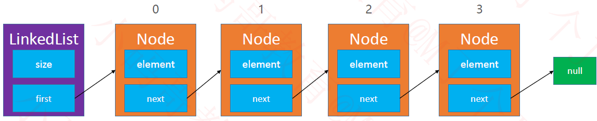
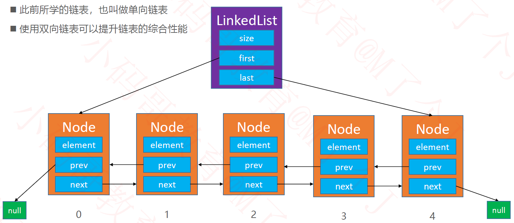
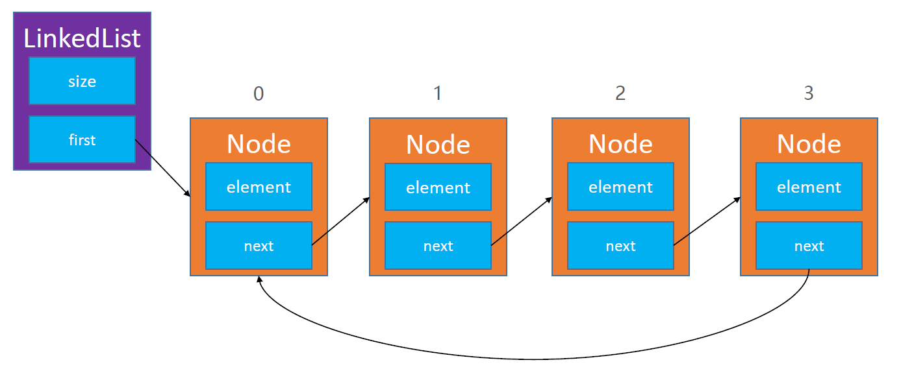
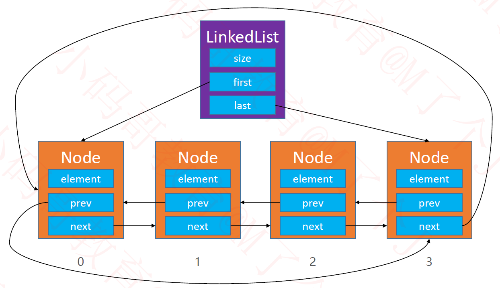
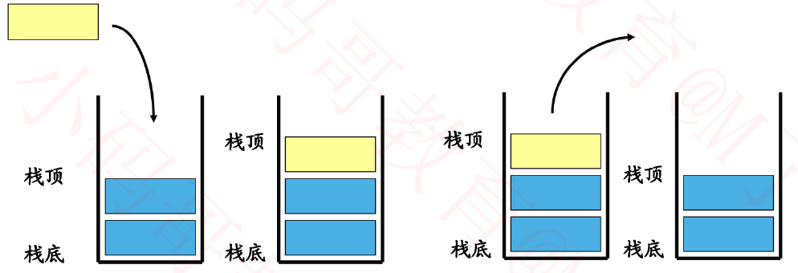
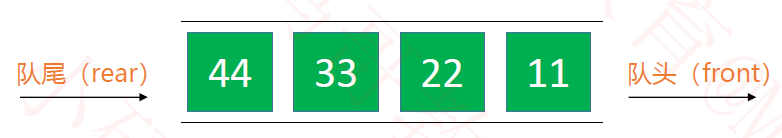

# 线性表

> 线性表是具有n个相同类型元素的有限序列（n >= 0）

* 常见的线性表
  * 数组、链表、栈、队列、哈希表（散列表）

# 一、 数组

> 数组是一种顺序存储的线性表，所有元素的内存地址是连续的

## 1. 为什么要有动态数组

* 在很多编程语言中，数组都是不可动态修改容量的

## 2. 动态数组是什么

* 动态数组是长度**可变**的数组，通过对数组进行扩容来实现长度可变

## 3. 接口

* 如果让我们自己设计的话，应该有这样的功能

  ```java
  public interface List<E> {
      int size(); // 元素的数量
      boolean isEmpty(); // 是否为空
      boolean contains(E element); // 是否包含某个元素
      void add(E element); // 添加元素到最后面
      E get(int index); // 返回index位置对应的元素
      E set(int index, E element); // 设置index位置的元素
      void add(int index, E element); // 往index位置添加元素
      E remove(int index); // 删除index位置对应的元素
      int indexOf(E element); // 查看元素的位置
      void clear(); // 清除所有元素
  }
  ```

## 4. 实现细节

1. 数据结构

   ```java
   public class ArrayList<E> {
       int size; // 用来记录数组有效元素的个数
       Object[] elements; // 存储对象的容器
   }
   ```

2. [`ArrayList.java`](https://github.com/ann-zhgy/inner-strength/tree/master/data-structure/src/main/java/cn/ann/part01/_02array/list/ArrayList.java)

3. 注意点：
   1. 数组扩容时，容量为原来的 1.5 倍，使用位运算符实现
   2. 数组创建时，系统会分配连续的内存，所以数组的取值效率很高，但是如果要在某个位置插入/删除数据，该位置之后的数据需要后移/前移，效率不高
   3. 我并没有实现数组的缩容操作，如果要实现，需要注意缩容时，要保留一些空余部分，否则很容易造成频繁的扩容缩容操作

4. 思考：我们现在写的 `ArrayList` 有没有可以改进的地方？

   1. …

# 二、链表

## 1. 为什么要有链表

1. 动态数组有个很明显的缺点
   * 可能会造成内存空间的大量浪费
2. 那么，能不能用多少内存就申请多少内存？
   * **链表可以！！**

## 2. 链表是什么

> 链表是一种链式存储的线性表，其存储的元素的内存地址不一定是连续的，可以分为单向链表、双向链表、单向循环链表、双向循环链表

## 3. 接口

* 链表的功能与动态数组的类似，直接使用 `List<E>` 接口就好了

  ```java
  public interface List<E> {
      int size(); // 元素的数量
      boolean isEmpty(); // 是否为空
      boolean contains(E element); // 是否包含某个元素
      void add(E element); // 添加元素到最后面
      E get(int index); // 返回index位置对应的元素
      E set(int index, E element); // 设置index位置的元素
      void add(int index, E element); // 往index位置添加元素
      E remove(int index); // 删除index位置对应的元素
      int indexOf(E element); // 查看元素的位置
      void clear(); // 清除所有元素
  }
  ```

* 链表和数组有共同的属性，有些方法的实现也是一样的，所以我们创建一个抽象的公共类用来继承

  [`AbstractList.java`](https://github.com/ann-zhgy/inner-strength/tree/master/data-structure/src/main/java/cn/ann/part01/_03linked/list/AbstractList.java)

## 4. 实现细节

### 1. 单向链表

1. 数据结构

   

   ```java
   public class SingleLinkedList<E> {
       // 头节点。
       // 有的人习惯使用头节点管理整个链表，并不会在其中放入元素
       // 有的人习惯头结点中放入第一个元素
       Node<E> head;
       
       private static class Node<E> {
           E element; // 存储的元素
           Node<E> next; // 指向下一个节点
       }
   }
   ```

2. 实现细节

   [singleLinkedList](https://github.com/ann-zhgy/inner-strength/tree/master/data-structure/src/main/java/cn/ann/part01/_03linked/list/SingleLinkedList.java)

3. 注意点：

   1. 链表的添加添加和删除的效率很高，但是查询取值的效率很低
   2. 链表不需要扩容，一般情况下，链表申请的内存空间是不连续的

### 2. 双向链表

1. 数据结构

   

   ```java
   public class DouobleLinkedList<E> {
       private final Node<E> head;
       private final Node<E> tail;
       
       private static class Node<E> {
           E element;
           Node<E> prev; // 指向前一个结点
           Node<E> next; // 指向后一个节点
       }
   }
   ```

2. 实现细节

   [DouobleLinkedList](https://github.com/ann-zhgy/inner-strength/tree/master/data-structure/src/main/java/cn/ann/part01/_03linked/list/DoubleLinkedList.java)

3. 注意点：

   1. 双向链表添加和删除时，要同时考虑上一个节点和下一个结点的指向问题
   2. 双向链表获取指定索引/位置的元素时，可以使用二分法进行获取，比单链表要快很多

### 3. 单向循环链表

1. 数据结构

   

   ```java
   public class SingleCircleLinkedList<E> extends AbstractList<E> {
       private Node<E> head;
   
       private static class Node<E> {
           E element;
           Node<E> next;
       }   
   }
   ```

2. 实现细节

   [SingleCircleLinkedList](https://github.com/ann-zhgy/inner-strength/tree/master/data-structure/src/main/java/cn/ann/part01/_03linked/list/SingleCircleLinkedList.java)

### 4. 双向循环链表

1. 数据结构

   

   ```java
   public class DoubleCircleLinkedList<E> {
       private final Node<E> head;
       
       private static class Node<E> {
           E element;
           Node<E> prev; // 指向前一个结点
           Node<E> next; // 指向后一个节点
       }
   }
   ```

2. 实现细节

   [DoubleCircleLinkedList](https://github.com/ann-zhgy/inner-strength/tree/master/data-structure/src/main/java/cn/ann/part01/_03linked/list/DoubleCircleLinkedList.java)

* **我个人比较喜欢使用`head`管理整个链表，所以`head`中并不存储值**
* 注意添加和删除元素时，各种赋值的顺序

# 三、栈

## 1. 什么是栈

* **栈**是一种特殊的线性表，只能在一段操作，遵循后进先出原则(Last In First Out/LIFO)

  * 向栈中添加元素的操作叫做 入栈/压栈(push)
  * 从栈中移除元素的操作叫做 出栈/弹栈(pop)

  

## 2. 接口

```java
public interface Stack {
    // 压栈
    void push(E ele);

    // 弹栈
    E pop();

    // 栈是否空
    boolean isEmpty();

    // 栈大小
    int size();

    // 栈顶部元素
    E top();
}
```

## 3. 实现细节

* [Stack](https://github.com/ann-zhgy/inner-strength/tree/master/data-structure/src/main/java/cn/ann/part01/_04stack/Stack.java)
* 栈的实现优先使用数组，因为它是在容器末尾增删元素

## 4. 应用场景 

1. 浏览器的前进后退功能
2. 软件的撤销、恢复
3. ……

# 四、队列

## 1. 什么是队列

* 队列是一种先进先出的线性结构

  * 只能向队尾添加元素——入队（enQueue）
  * 只能从队首取出元素——出队（deQueue）

  

## 2. 接口

```java
public class Queue {
    int size(); // 元素的数量
    boolean isEmpty(); // 是否为空
    void clear(); // 清空
    void enQueue(E element); // 入队
    E deQueue(); // 出队
    E front(); // 获取队列的头元素
}
```

## 3. 实现细节

* [Queue](https://github.com/ann-zhgy/inner-strength/tree/master/data-structure/src/main/java/cn/ann/part01/_05queue/Queue.java)
* 队列的实现优先选择使用双向链表，只在首尾增删元素即可
* 如果基于数组，使用循环索引的方法实现的话，只需要进行取模（%）操作就可以了

## 4. 应用场景